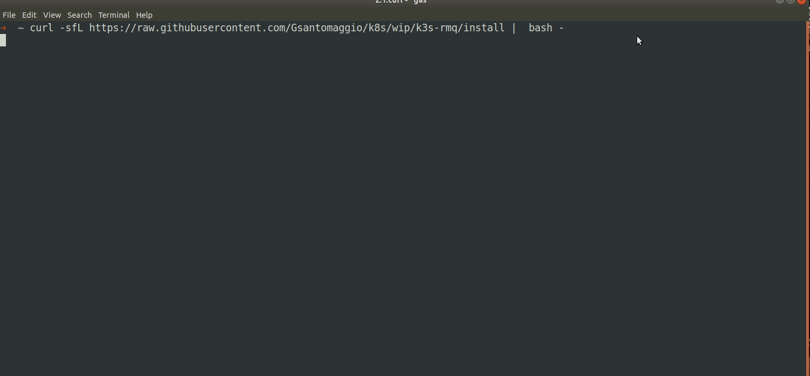

# Description
---
Install a lightweight Kubernetes with a RabbitMQ Cluster.
Compontents:
 - [K3s](https://k3s.io/)
 - [RabbitMQ](www.rabbitmq.com)
 - [RabbitMQ Operator](https://www.rabbitmq.com/kubernetes/operator/operator-overview.html)
 - [k9s](https://github.com/derailed/k9s) (only in Vagrant)
 


# How to install (only Linux)
---

```bash
curl -sfL https://raw.githubusercontent.com/Gsantomaggio/k8s/wip/k3s-rmq/install |  bash -
```
The setup may require a few minutes...

Check the credentials and the url to access to the cluster.
As result you should have something like:
```
[INFO]  Management UI: http://192.168.1.75:15672
[INFO]  AMQP: 192.168.1.75:5672
[INFO]  Credentials:
username: 1ZZZWMCttegIIZSUKzdsyk39bhf4yyqP
password: aIMOJafZEngc_94ePchT778nU9zvutOI
```

# Vagrant (all users)
---

Deploy it in Vagrant:

The vagrant machine requires:
* 4 cpus
* 8 GB Ram 

For Linux users:
```
#!/bin/bash

curl https://raw.githubusercontent.com/Gsantomaggio/k8s/wip/k3s-rmq/Vagrantfile -o Vagrantfile
vagrant up
```

For not Linux users

* Download the file: `https://raw.githubusercontent.com/Gsantomaggio/k8s/wip/k3s-rmq/Vagrantfile` 
* `vagrant up`


Demo:


